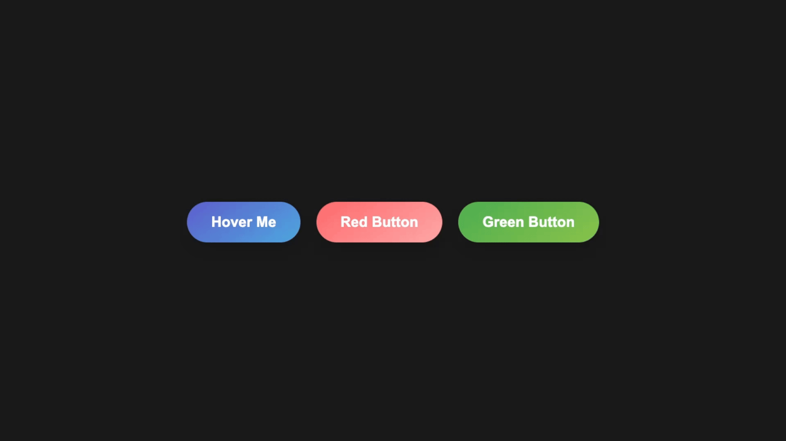

# Magical Button Hover Effect

A lightweight yet impressive CSS/JS button animation system with dynamic color customization. This project demonstrates how to create engaging UI elements with minimal code.



## Features

- 3D perspective hover animations with smooth transitions
- Dynamic color customization via HTML data attributes
- Elegant shine effect that sweeps across buttons
- Anti-jitter technology for seamless interaction
- Cross-browser compatible design

The buttons feature a satisfying tilt effect, subtle scaling, and customizable glow effects that match each button's unique color scheme. Simply add your desired color values as data attributes and the system automatically generates the appropriate animations and effects.

Perfect for designers and developers looking to add that extra touch of interactivity to forms, landing pages, or call-to-action elements without the bloat of animation libraries.

## Usage

```html
<button class="magic-btn" data-color="#5e60ce" data-color2="#4ea8de">Hover Me</button>
```

## Live Demo

Check out the [live demo](https://example.com) to see the buttons in action.

---

*Minimal code. Maximum impact.*